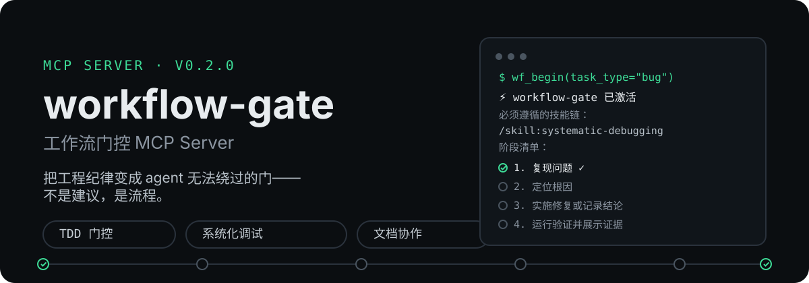
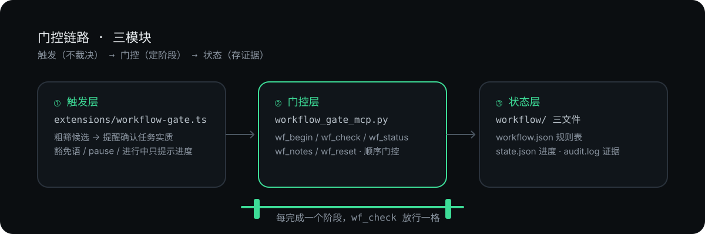

# workflow-gate

> 把工程纪律变成 agent 无法绕过的门——不是建议，是流程。

[](LICENSE)
[](https://modelcontextprotocol.io)
[](https://www.python.org)
[](CHANGELOG.md)



`workflow-gate` 是一个本地 MCP Server：把实践中验证过的开源 Agent 技能（Superpowers 方法论 + Anthropic 文档协作）编排成「任务类型 → 强制技能链 → 阶段门控」，让你的 coding agent 在**正确的时间、做正确的事、用正确的方法**——任务开始前拿到规定的阶段清单，每完成一步用 `wf_check` 放行，声称"完成"之前先过验证门。

## 先跑起来

```bash
pip install mcp pydantic
```

把 `workflow_gate_mcp.py` 与 `workflow.json` 放到 `~/.pi/agent/workflow/`，然后在 MCP 配置中注册：

```json
{
  "mcpServers": {
    "workflow-gate": {
      "command": "python",
      "args": ["C:\\Users\\<你>\\...\\workflow\\workflow_gate_mcp.py"]
    }
  }
}
```

下一条消息就会收到提醒；agent 调用 `wf_begin(task_type="bug")` 即拿到阶段清单开始门控。pi 用户可同时部署 `extensions/` 获得输入侧提醒。

## 为什么不同

| 机制 | 说明 |
|---|---|
| 🚦 **阶段门控，而非空话** | 每个流程拆成有序阶段，逐阶段 `wf_check` 标记；可选 `"ordered": true` 强制按序，声称完成前必须过「验证」门 |
| 🤝 **触发而非裁决** | pi 扩展只粗筛候选并**与用户确认**任务实质（交付物是代码/文档/决策）后再启动流程，分类准确率从关键词式约 40% 大幅提升 |
| ⚪ **随时可豁免** | 用户显式声明不走流程（豁免语 / `wf_begin(task_type="none")` / `/workflow pause`），流程是建议框架，任务实质是裁决者 |
| 📜 **证据可审计** | `wf_check(evidence=...)` 附验证证据，`wf_notes` 回读；全部动作 UTC 时间戳写入 `audit.log` |
| 🧩 **零代码扩展** | 技能链、阶段、开关全在 `workflow.json`，加一类任务不改代码 |

## 门控示例（会话实录）

```
用户: 这个接口报 500 错误，帮我修一下

> ⚙️ workflow-gate：检测到可能是「bug」相关任务（候选：bug）。
> 请先与用户确认任务实质（交付物是代码/文档/决策？），再调用 wf_begin(task_type=...)
> 获取阶段清单；若确实不需要流程，调用 wf_begin(task_type="none") 声明豁免。

─── 代理与用户确认后 ───
⚡ workflow-gate 已激活 · 任务类型「bug」
必须遵循的技能链：
  /skill:systematic-debugging
阶段清单（每完成一步调用 wf_check 标记）：
  ○ 1. 复现问题
  ○ 2. 定位根因
  ○ 3. 实施修复或记录结论
  ○ 4. 运行验证并展示证据
```

每完成一步：`wf_check(stage="reproduce", evidence="pytest 输出见 /tmp/x.log")`，`wf_notes` 可回读审计；全部完成提示 `wf_reset`。

## 使用

### 工具一览

| 工具 | 调用时机 | 作用 |
|---|---|---|
| `wf_begin` | 任务开始时 | 按类型返回技能链与阶段清单；`task_type="none"` 声明豁免 |
| `wf_check` | 阶段完成时 | 标记阶段、显示下一步；可选 `evidence` 附验证证据 |
| `wf_status` | 任意时刻 | 查看任务类型、进度、留痕数量 |
| `wf_notes` | 回读备注时 | 列出阶段备注与证据；`history=true` 追加历史任务归档 |
| `wf_reset` | 任务结束时 | 清除任务状态 |
| `wf_audit` | 追溯审计时 | 读取 audit.log 最近记录（begin/check/豁免/规则变更）；`limit` 可选 |
| `wf_rules` | 管理规则时 | 查看/启用/禁用规则（无 pi 扩展时替代原 `/workflow` 命令）；`list` / `enable <rule>` / `disable <rule>` |

### 任务类型 → 技能链（11 类 + 豁免）

| 类型 | 触发场景 | 强制技能链 | 阶段 |
|---|---|---|---|
| `bug` | 报错 / 测试失败 / 异常行为 | `systematic-debugging` | 复现问题 → 定位根因 → 实施修复或记录结论 → 运行验证并展示证据 |
| `implement` | 实现功能/修复 | `test-driven-development` | 先写测试 → 实现功能 → 测试通过 |
| `multi_step` | 重构/迁移/搭建/新项目 | `writing-plans` + `executing-plans` | 产出计划 → 按计划执行 |
| `feature_design` | 新功能/创意设计 | `brainstorming` | 探索需求与设计选项 → 与用户确认方案 |
| `doc_writing` | 正式文档（报告/README/说明书） | `doc-coauthoring` | 明确文档结构与读者 → 撰写初稿 → 复核文档可用性 |
| `decision` | 讨论/决策（先聊清楚再定） | `brainstorming` | 讨论澄清需求 → 与用户确认方案 → 记录决策结论 |
| `research` | 调研/检索/素材收集 | （不绑定技能） | 检索/收集素材 → 综合分析 → 产出成果 |
| `review` | 评审/全面回顾找问题 | `systematic-debugging` | 全面扫描问题 → 归类与分级 → 实施修复或记录结论 → 运行验证并展示证据 |
| `merge` | 合并/交付 | `requesting-code-review` + `finishing-a-development-branch` | 自查 diff 与测试 → 发起评审 → 合并交付 |
| `review_received` | 收到评审意见 | `receiving-code-review` | 评估评审意见 → 实施修改 |
| `isolation` | 隔离工作区开发 | `using-git-worktrees` | 创建隔离工作区 → 在隔离区开发 → 合并回主工作区 |
| `none` | 显式不走流程 | — | 豁免（audit 留痕，不残留状态） |

## pi 扩展（v1.1 合规版）

自动提醒由 pi 扩展提供（官方子目录结构 `extensions/workflow-gate/{index.ts,core.ts}`），安全设计：异常隔离（扩展出错不影响 pi 输入）/ 同步工厂 / 零网络调用。支持 `/workflow list|status|enable|disable|pause|resume` 命令。

**提醒分两级**（减少打扰）：
- **直接型**（bug/implement/review/research/doc_writing）：识别后直接建议 `wf_begin`，不再询问；
- **确认型**（feature_design/multi_step/decision/merge/isolation）：先与用户确认任务实质再启动；
- 豁免：消息含豁免语（"先讨论/跳过流程"）或 `wf_begin(task_type="none")` 即不触发。

### 触发机制

```
用户消息 ─▶ ① 豁免语？ 是▶ 静默        ─▶ ② /workflow pause？ 是▶ 静默
           ─▶ ③ 有进行中任务？ 是▶ 仅提示进度（不重复分类）
           ─▶ ④ 关键词粗筛候选（11 类优先级排序）
                ├─ 直接型（5 类）▶ 提醒「建议直接 wf_begin」
                └─ 确认型（5 类）▶ 提醒「先确认任务实质」
```

## 架构



### 文件布局

| 文件 | 说明 |
|---|---|
| `workflow_gate_mcp.py` | MCP Server（5 工具：状态、审计、门控输出） |
| `workflow.json` | 规则表：任务类型 → 技能链/阶段/开关；`"ordered": true` 强制顺序 |
| `extension/workflow-gate/index.ts` | pi 扩展入口（input 提醒、`/workflow` 命令）；官方子目录模式（仅发现 `*/index.ts`，core.ts 不会误加载为扩展） |
| `extension/workflow-gate/core.ts` | 扩展纯逻辑（11 类候选/两级提醒/豁免），node --test 20 例 |
| `tests/` `test/` | Python（unittest 18 例）+ TypeScript（node:test 20 例） |
| `state.json` / `audit.log` | 运行时进度与审计（不入库） |

自定义规则只需在 `workflow.json` 追加：

```json
{
  "your_task_type": { "enabled": true, "skills": ["skill-a"], "stages": ["stage-1", "stage-2"] }
}
```

## 上游致谢

workflow-gate 不做方法论发明，只做编排与执行。规则表引用的技能均来自以下开源项目（技能内容的版权归原作者）：

| 技能 | 上游项目 | 许可 |
|---|---|---|
| `systematic-debugging` `test-driven-development` `writing-plans` `executing-plans` `brainstorming` `verification-before-completion` `requesting-code-review` `receiving-code-review` `finishing-a-development-branch` `using-git-worktrees`（10 个） | [obra/superpowers](https://github.com/obra/superpowers) · by Jesse Vincent (obra) & Prime Radiant | MIT |
| `doc-coauthoring`（1 个） | [anthropics/skills](https://github.com/anthropics/skills) | Apache 2.0（开源部分） |

## License

MIT License（见 `LICENSE`）。引用的技能内容遵循其各自上游许可。

> **免责声明**：本工具是流程约束器，不提供代码修复/测试/文档能力；依赖你环境中已部署的对应技能（`/skill:xxx`）。请确保技能文件正确部署，否则门控提示与实际行动可能脱节。

<p align="center">
  <a href="https://github.com/oil-oil/beautify-github-readme"></a>
</p>
